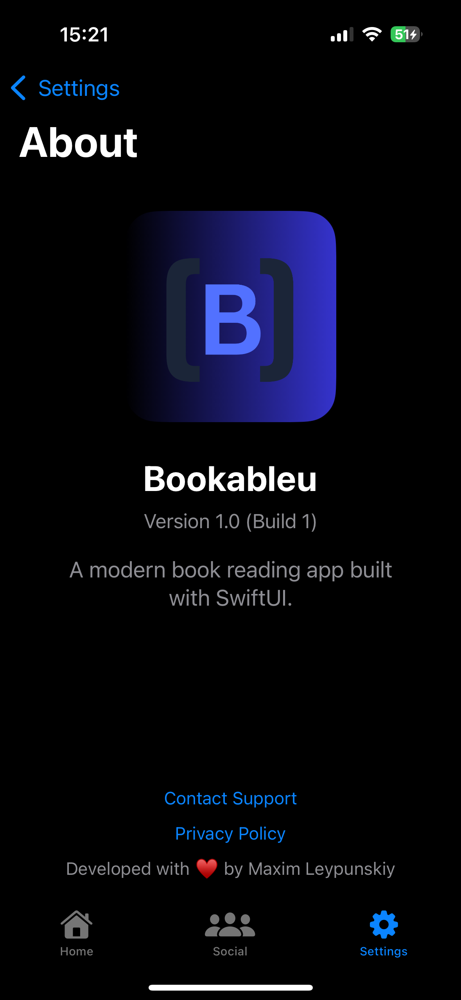

# Bookableu

[](https://swift.org)
[](https://www.python.org/downloads/)
[](https://fastapi.tiangolo.com/)
[](LICENSE)


## Overview

Bookableu is a comprehensive e-reader platform that includes an iOS application and a backend API. The platform allows users to read, manage, and share their e-book collection with a rich set of features.

## Demo Screenshots

### Reading Experience
<div style="display: flex; flex-wrap: wrap; gap: 10px; justify-content: center;">
  
  
  
  
</div>

### Settings and More
<div style="display: flex; flex-wrap: wrap; gap: 10px; justify-content: center;">
  
  
  
  
</div>

### Additional Features
<div style="display: flex; flex-wrap: wrap; gap: 10px; justify-content: center;">
  
  
  
  
</div>

### API Endpoints
<div style="display: flex; flex-wrap: wrap; gap: 10px; justify-content: center;">
  
</div>

## Project Structure

The project consists of two main components:

- **iOS Application** (`src/bookableu-ios/`): A SwiftUI-based iOS app for reading and managing e-books
- **Backend API** (`src/bookableu-backend/`): A FastAPI-based Python backend providing authentication, book management, and other services

## Features

### iOS Application
- Multiple e-book format support (PDF, EPUB)
- Library management and organization
- Customizable reading experience
- Reading statistics and progress tracking
- Cloud synchronization
- Social features and book discussions

### Backend API
- User authentication and authorization
- Book catalog management
- Advanced search with machine learning
- E-book processing and content extraction
- AI-powered book recommendations
- Analytics and usage tracking

## Architecture

### iOS Application Architecture
- **MVVM Design Pattern**: Separation of UI (Views), Data (Models), and Logic (ViewModels)
- **SwiftUI Framework**: Declarative UI framework for building the interface
- **SwiftData**: Local persistence layer for offline storage of books and user data
- **Combine Framework**: Reactive programming for handling asynchronous events
- **Core components**:
  - `BookReader`: Core reading experience with format-specific rendering
  - `LibraryManager`: Book collection and organization
  - `UserProvider`: Authentication and user profile management
  - `APIService`: Communication with the backend API

### Backend Architecture
- **FastAPI Framework**: High-performance asynchronous API framework
- **PostgreSQL Database**: Relational database for structured data storage
- **SQLAlchemy ORM**: Object-relational mapping for database interactions
- **JWT Authentication**: Secure token-based authentication system
- **Core components**:
  - RESTful API endpoints
  - Background task processing
  - Machine learning pipeline for recommendations
  - E-book content extraction and analysis

## Technology Stack

### iOS Application
- **Swift 5.9+**: Programming language
- **SwiftUI**: UI framework
- **SwiftData**: Persistence framework
- **PDFKit**: Native PDF rendering
- **FolioReaderKit**: EPUB rendering and management
- **KeychainAccess**: Secure credential storage
- **Alamofire**: Networking library
- **Kingfisher**: Image caching and loading

### Backend
- **Python 3.8+**: Programming language
- **FastAPI**: Web framework
- **PostgreSQL**: Database
- **SQLAlchemy**: ORM
- **PyJWT**: Authentication
- **Passlib**: Password hashing
- **PyMuPDF & ebooklib**: E-book processing
- **scikit-learn & faiss-cpu**: Machine learning
- **OpenAI API**: AI integration
- **AWS S3**: File storage

## Integration Flow

The iOS application and backend API communicate through a RESTful API:

1. **Authentication Flow**:
   - User credentials are sent to the backend
   - Backend validates and returns JWT tokens
   - iOS app stores tokens securely in Keychain
   - Token refresh mechanism handles expiration

2. **Book Management Flow**:
   - Books are uploaded from iOS to backend
   - Backend processes and extracts metadata
   - Processed books are made available for download
   - Reading progress is synchronized between devices

3. **Social & Recommendation Flow**:
   - User reading habits are analyzed
   - AI models generate personalized recommendations
   - Users can connect and share reading experiences
   - Book discussions are synchronized in real-time

## Development Practices

- **Git Flow**: Feature branch workflow for collaborative development
- **CI/CD**: Automated testing and deployment pipelines
- **Code Reviews**: Peer review process for all changes
- **Documentation**: Comprehensive inline and external documentation
- **Testing**: Unit, integration, and UI testing

## Detailed Component Documentation

For in-depth information about each component:

- [iOS Application Documentation](src/bookableu-ios/README.md)
- [Backend API Documentation](src/bookableu-backend/README.md)

## Code Statistics

The project consists of the following code distribution:

```
-------------------------------------------------------------------------------
Language                     files          blank        comment           code
-------------------------------------------------------------------------------
Swift                           27            833            779           4536
Python                          15            432            916           1564
JavaScript                       1             59             16            517
Markdown                         3            105              0            363
CSS                              1             59             13            353
XML                              6              0              0            161
HTML                             1             10              8            119
JSON                             5              0              0             78
Bourne Shell                     1              6              5             32
Text                             1              0              0             19
-------------------------------------------------------------------------------
SUM:                            61           1504           1737           7742
-------------------------------------------------------------------------------
```

## License

This project is licensed under the MIT License - see the [LICENSE](LICENSE) file for details.

## Contact

Maxim Leypunskiy - max.leypunskiy@outlook.com

Project Links:
- GitHub: [https://github.com/objc1/Bookableu](https://github.com/objc1/Bookableu)